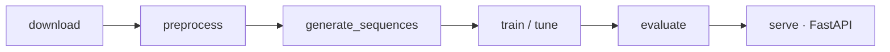

# 🫀 HeartWaveML - an automatic ECG Heartbeat Classification

<div align="center">

[](https://github.com/JoseGarciaMayen/HeartWaveML/actions/workflows/main.yml)
[](https://www.python.org/downloads/)
[](https://tensorflow.org/)
[](LICENSE)
[](https://www.kaggle.com/code/josegarciamayen/heartwaveml)


</div>

## Project Overview
This project implements a machine learning pipeline for **automated ECG heartbeat classification**, classifying heartbeats into 3 clinical categories (Normal, Supraventricular ectopic, Ventricular ectopic) following the AAMI convention. The system processes raw ECG signals and classifies heartbeats in <100 ms.



Curious how the project got here, architectures tried, bugs found and fixed, lessons learned? See [`docs/JOURNEY.md`](docs/JOURNEY.md).

## Live Demo
👉 [Try the demo here](https://heartwaveml.josegarciamayen.com)


## Model results

Metrics below use the **patient-wise inter-patient split** (DS1/DS2, see
[Evaluation methodology](#evaluation-methodology)), no data leakage between
train and test, and are read straight from `src/saved_models/metrics/metrics.json`
(regenerated by `src/evaluate.py` on every promoted model). An earlier
generation of tree models (LGBM/ExtraTrees/CatBoost/CONVXGB) was tried first
and dropped from this repo once the leakage was fixed and their honest
scores plateaued at f1_macro ~0.51-0.58. The XGBoost row below is a
different, later baseline: rebuilt from scratch after that fix, on
uncorrupted features, and kept because it's competitive.

<div align="center">

| Model | F1-N | F1-S | F1-V | F1-macro |
|-------|------|------|------|----------|
| CNN-MLP | 0.894 | 0.118 | 0.465 | 0.492 |
| XGBoost (tabular baseline) | 0.955 | 0.324 | 0.759 | 0.680 |
| TCN (W=45) | 0.967 | 0.286 | 0.825 | 0.693 |
| Seq2Seq BiLSTM (W=45) | 0.972 | 0.446 | 0.814 | 0.744 |
| **Transformer (W=45)** | **0.971** | **0.426** | **0.862** | **0.753** |

</div>

The Transformer is currently the best-performing model, still short of the
project's f1_macro ≥ 0.80 target. The S class (supraventricular ectopic beats)
is the main bottleneck: it is diagnosed mostly by rhythm (RR intervals)
rather than beat morphology, which is harder for the model to learn from a
fixed-size window.

## Evaluation methodology

The dataset is split **patient-wise** (the inter-patient paradigm): all
heartbeats from a given record (patient) are assigned to a single set, so no
patient appears in both train and test. This follows the de Chazal DS1/DS2
partition and is enforced in `split_data` (`src/data/splitter.py`) via the
fixed `DS1_RECORDS`/`DS2_RECORDS`/`CV_RECORDS` record sets (train/val come
from DS1, test is the fully unseen DS2).

This avoids **inter-patient data leakage**, where a random per-beat split lets
the model memorise patient-specific morphology and report optimistic metrics
that do not generalise to unseen patients. Expect lower (but honest) scores
than an intra-patient split.

## Features
- Data **preprocessing** and **feature extraction** from raw ECG signals.

- **Tuning and training** of several sequence models (Seq2Seq BiLSTM, **Transformer**, TCN) and a CNN-MLP baseline using **TensorFlow**.

- Model **evaluation** using appropriate metrics for multiclass classification.

- Experiment tracking using **ClearML**.

- **Notebook** for interactive experiments and visualization [here](https://www.kaggle.com/code/josegarciamayen/heartwaveml)

- **DVC** with **Dagshub s3 bucket** for data versioning and keeping track of our models.

- **Docker + FastAPI** to serve an easy-to-use interactive API.

- **Continuous Integration** (CI) using Github Actions.


## Quick Start
There are three ways to run **HeartWaveML**:

### 1️⃣ Run only the API (via Docker)
If you only need the API, simply pull the [Docker image](https://hub.docker.com/r/josegm61/heartwaveml/tags) (<800MB):

```bash
docker pull josegm61/heartwaveml:latest
docker run -p 8000:8000 josegm61/heartwaveml:latest
```

The API will be running on http://localhost:8000
You can open `web/index.html` in your browser to interact with it. You can also see every endpoint at the [Swagger UI](http://localhost:8000/docs)

### 2️⃣ Use pretrained models and datasets (via DVC)
If you want to use the trained models and datasets:
```bash
dvc pull
pip install -r requirements.txt
```
This will fetch the models and datasets tracked with DVC and install dependencies (you will need a [Dagshub account](https://dagshub.com/))

### 3️⃣ Train models from scratch
If you prefer to generate the dataset and train the models yourself:
```bash
pip install -r requirements-dev.txt
# 1. generate datasets with the patient-wise split
python -m src.data.generate_data --mode deterministic
python -m src.data.generate_sequences
# 2. start ClearML, then tune + train
python -m src.pipeline tune transformer
python -m src.pipeline train transformer
```
Then serve the API with:
```bash
python -m src.api
```
This is the recommended option if you want to use this repo as a template to train your own models and try other combinations. Available models: `cnn_mlp`, `seq2seq`, `transformer`, `tcn`, `xgb` (swap `transformer` for any of them in the commands above).

### 4. Train on Kaggle with Remote Bridge

Remote Bridge can sync the project from your IDE to the Kaggle runtime and stream tuning/training
output locally. The same tuner and trainer modules used locally are executed remotely; there is no
second Kaggle entrypoint.

```bash
remote-bridge doctor project
```

Publish `data/processed/` once through the official Kaggle API:

```bash
remote-bridge dataset upload \
    josegarciamayen/heartwaveml-features \
    data/processed \
    --version-notes "processed dataset"
```

From the project root, open the remote shell. It automatically prepares the configured project:

```bash
remote-bridge shell \
    --headed \
    --browser-channel chrome \
    --connect-timeout 300
```

Inside the shell, use the same modules as in local execution. Remote Bridge configures the Kaggle
runtime, mounts the dataset, enables the GPU and loads ClearML secrets before importing TensorFlow:

```bash
python -m src.tuning.tune_xgb
python -m src.training.train_xgb
python -m src.tuning.tune_transformer
python -m src.training.train_transformer
```

Remote Bridge detects the available accelerator before starting the project and reports
`gpu`, `tpu`, or `none`. It exports the result as `REMOTE_BRIDGE_ACCELERATOR` and maps it to
`PROJECT_DEVICE` (`cuda`, `tpu`, or `cpu`).

ClearML is mandatory for these direct tuning/training commands. Configure its API credentials with
Kaggle Secrets or `CLEARML_API_HOST`, `CLEARML_API_ACCESS_KEY`, `CLEARML_API_SECRET_KEY` and
`CLEARML_WEB_HOST`; the credentials are never synced or printed. Results and the best Optuna
parameters can be pulled into `remote-bridge/`.

#### CPU training performance

Local runs remain CPU-only by default. Remote Bridge sets the generic `PROJECT_DEVICE=cuda`
contract, which HeartWaveML maps to GPU configuration. Two things speed up CPU runs without
changing results:

- **XLA (`jit_compile=True`)**: instead of running each op eagerly, TensorFlow/XLA compiles the model into an optimized graph adapted to the host CPU before running it. Enabled on every `model.compile()` call in `src/training/` and `src/tuning/`.
- **Thread pinning**: `configure_tf_threads()` (`src/config.py`) sets TF's intra/inter-op thread pools from `config.yaml` → `hardware`. Leave `intra_op_threads: null` to auto-detect via `os.cpu_count()`, or set an explicit number to cap it.

## Project Structure
```
HeartWaveML/
├── .dvc/                         # DVC control files
├── .github/workflows/main.yml    # CI pipeline with GitHub Actions
├── assets/                       # Photos and videos
├── data/                         # Datasets (tracked in DVC)   
├── docs/
│   ├── JOURNEY.md                 # Project history: decisions, bugs, lessons learned
│   └── DISTRIBUTED_TUNING.md      # ClearML multi-machine tuning setup
├── src/                          # Source code
│   ├── data/
│   │   ├── download_dataset.py   # Script to download dataset
│   │   ├── generate_data.py      # Script to generate the base/feat datasets
│   │   ├── generate_sequences.py # Builds (N, W, 46) windows for Seq2Seq/Transformer/TCN
│   │   ├── features.py           # 36 morphological + 10 RR/HRV features
│   │   └── splitter.py           # Inter-patient DS1/DS2 split (de Chazal)
│   ├── training/                 # Training logic (trainer.py + one train_*.py per model)
│   ├── tuning/                   # Hyperparameter tuning (tuner.py + one tune_*.py per model)
│   ├── pipelines/
│   │   └── model_pipeline.py     # ClearML PipelineController (multi-machine tuning)
│   ├── saved_models/             # Trained models (tracked in DVC)
│   ├── api.py                    # API to serve the model
│   ├── config.py                 # Loads config.yaml, thread pinning
│   ├── evaluate.py               # Model evaluation
│   ├── pipeline.py               # Local CLI for tune/train/evaluate
│   ├── predict.py                # Run predictions on new data
│   ├── preprocessing.py          # Data preprocessing functions
│   └── utils.py                  # Helper functions (losses, class weights, Telegram)
├── tests/                        # pytest suite (invariants, API, predict)
├── web/
│   └── index.html                # Web interface
├── deploy/                       # systemd unit files for ClearML agents
├── .dockerignore                 # Ignore files in Docker builds
├── .env.example                  # Template for local .env (Telegram, ClearML)
├── .gitignore                    # Ignore files in git
├── config.yaml                   # Hyperparameters, search spaces, hardware
├── CONTRIBUTING.md               # Setup, make ci gate, PR flow
├── Dockerfile                    # Docker image definition
├── dvc.lock                      # Exact DVC state for data/pipelines
├── dvc.yaml                      # DVC pipeline definitions
├── LICENSE                       # Project license
├── Makefile                      # `make ci` (lint + format check + tests)
├── pytest.ini                    # pytest configuration
├── README.md                     # Main documentation
├── requirements.txt              # Core dependencies
├── requirements-dev.txt          # + lint/test/notebook deps for contributors
├── requirements_api.txt          # Minimal deps to serve the API
└── ruff.toml                     # Lint/format configuration

```
## Dataset

We use the [MIT-BIH Arrhythmia Database](https://physionet.org/content/mitdb/1.0.0/), a widely used benchmark dataset for ECG signal classification. The dataset contains 48 half-hour recordings of two-lead ambulatory ECG signals sampled at 360 Hz. Each recording is annotated with beat labels, indicating the type of each heartbeat according to standard conventions.

Each ECG segment is resampled or cropped to 187 samples, then scaled and filtered. The process of filtering and scaling is a must to improve our models performance:


There are lots of heartbeats types:


So we first map the raw annotation symbols into 5 classes:

```python
class_mapping = {
    'N': 0, '·': 0, 'L': 0, 'R': 0, 'e': 0, 'j': 0,           # Normal beat
    'A': 1, 'a': 1, 'J': 1, 'S': 1,                           # Supraventricular ectopic beat
    'V': 2, 'E': 2,                                           # Ventricular ectopic beat
    'F': 3,                                                   # Fusion beat
    '/': 4, 'f': 4, 'x': 4, 'Q': 4, '|': 4, '~': 4            # Paced / unknown beat
}
```

Raw distribution at this stage:

<div align="center">

| Class | Count |
|--------|-------|
| **0** (Normal) | 90608 |
| **1** (Supraventricular) | 2781 |
| **2** (Ventricular) | 7235 |
| **3** (Fusion) | 802 |
| **4** (Paced/unknown) | 8981 |

</div>

This 5-class mapping is not the final label set used for training/evaluation.
Per the AAMI convention, class 3 (Fusion) is **remapped into class 2**
(Ventricular) - a fused beat is, by definition, part ventricular - and class 4
(paced/unknown) is **dropped entirely**, since paced beats are a device
artifact rather than a heart rhythm to classify. This leaves the 3 final
classes (N/S/V) reported in [Model results](#model-results).

To fix the extreme class imbalance we use per-class weights instead of oversampling: `class_weight` for the many-to-one CNN-MLP and a per-position `sample_weight` array for the many-to-many models (Seq2Seq, Transformer, TCN), both computed in `src/utils.py`.

```python
def get_class_weights(y_train):
    y = pd.Series(y_train).reset_index(drop=True)
    unique_classes = sorted(y.unique())
    n, k = len(y), len(unique_classes)
    return {cls: n / (k * (y == cls).sum()) for cls in unique_classes}
```

And then we split the data into train, validation and test. Each model consumes one of these datasets:

<div align="center">

| Dataset | Description | Used by |
|--------|-------|-------|
| **base** | Scaled and filtered 187-sample signal | (kept for reference) |
| **feat** | Signal + 46 engineered features | CNN-MLP |
| **seq** | (N, W, 46) sequence windows around each beat | Seq2Seq, Transformer, TCN |

</div>

## Distributed Tuning with ClearML

`PipelineController` (`src/pipelines/model_pipeline.py`) can run the full
**tune → train → evaluate** flow for a model as jobs on a
[ClearML](https://clear.ml/) queue, so you can tune several models **in
parallel on different machines** - e.g. `transformer` on one VM, `seq2seq`
on another, `cnn_mlp` on your own laptop, all reporting to the same server.

See [`docs/DISTRIBUTED_TUNING.md`](docs/DISTRIBUTED_TUNING.md) for the full
single-machine and multi-machine setup (including screenshots of it running).

## Citation

```
Moody GB, Mark RG. The impact of the MIT-BIH Arrhythmia Database. IEEE Eng in Med and Biol 20(3):45-50 (May-June 2001). (PMID: 11446209)
```

```
Goldberger, A., Amaral, L., Glass, L., Hausdorff, J., Ivanov, P. C., Mark, R., ... & Stanley, H. E. (2000). PhysioBank, PhysioToolkit, and PhysioNet: Components of a new research resource for complex physiologic signals. Circulation [Online]. 101 (23), pp. e215–e220. RRID:SCR_007345.
```

```
Farag, M. M. (2023). A Tiny Matched Filter-Based CNN for Inter-Patient ECG Classification and Arrhythmia Detection at the Edge. Sensors, 23(3), 1365.
```

```
Zahid, M. U., Kiranyaz, S., et al. (2022). Global ECG Classification by Self-Operational Neural Networks with Feature Injection. IEEE Transactions on Biomedical Engineering.
```

```
Mousavi, S., & Afghah, F. (2019). Inter- and Intra-Patient ECG Heartbeat Classification For Arrhythmia Detection: A Sequence to Sequence Deep Learning Approach. ICASSP 2019.
```

```
He, J. (2020). Automated Heart Arrhythmia Detection from Electrocardiographic Data (Doctoral thesis).
```

```
A Systematic Review of ECG Arrhythmia Classification: Adherence to Standards, Fair Evaluation, and Embedded Feasibility (2025). Review of 122 studies (2017-2024) under the E3C paradigm.
```

```
Salimi, A., et al. (2023). Exploring Best Practices for ECG Pre-Processing in Machine Learning. arXiv:2311.04229.
```

## Contributing
Contributions are welcome! See [`CONTRIBUTING.md`](CONTRIBUTING.md) for
setup, the `make ci` gate, and the PR flow. For questions or feedback, reach
out at josegarciamayen@gmail.com.
